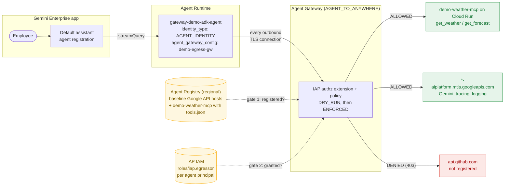
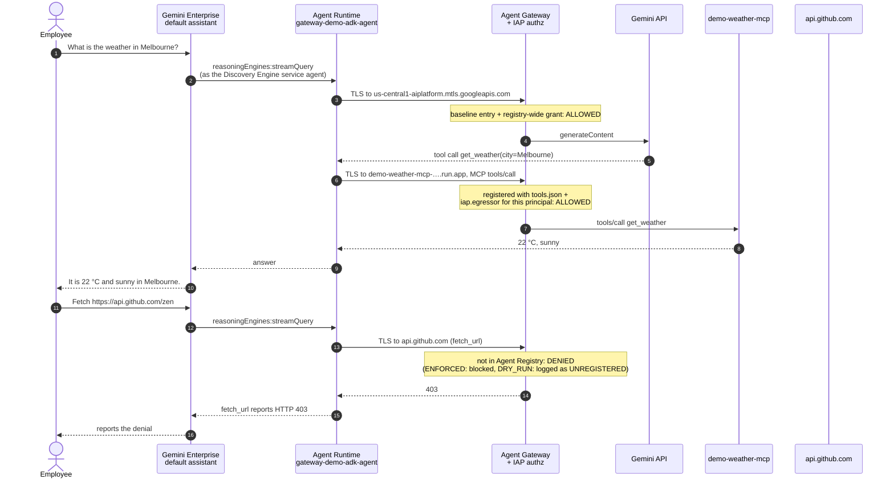
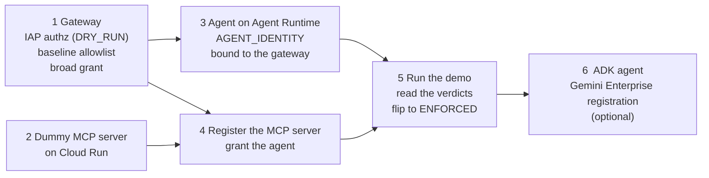
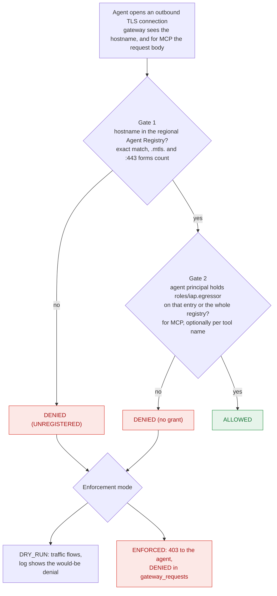

# Agent Gateway quickstart

A minimal, end-to-end example of the **govern** layer of **Gemini Enterprise
Agent Platform (GEAP)**: an agent hosted on **Agent Runtime** runs with an
**Agent Identity**, every outbound call it makes goes through an **Agent
Gateway**, the gateway lets through only destinations that are in **Agent
Registry** *and* granted to that identity, and the governed agent is handed to
end users inside a **Gemini Enterprise** app.

The path it sets up, in order:

1. create an `AGENT_TO_ANYWHERE` gateway with IAP enforcement,
2. deploy a dummy MCP server (canned weather data) to Cloud Run,
3. deploy a tiny agent to Agent Runtime that runs with `AGENT_IDENTITY` and is
   bound to the gateway,
4. register the MCP server in Agent Registry and grant the agent
   least-privilege access to it,
5. watch the gateway log an **ALLOWED** verdict for the MCP call and a
   **DENIED** verdict for an unregistered API,
6. (optional) deploy an ADK agent the same way and register it in a **Gemini
   Enterprise** app, so employees get the governed agent in their UI.

Everything is also available as a single `terraform apply` — see
[Terraform](#terraform).

```
   ┌──────────────────────┐        ┌────────────────────────┐
   │  gateway-demo-agent  │        │  AGENT_TO_ANYWHERE     │──▶ demo MCP server   ALLOWED
   │  (AGENT_IDENTITY)    │───────▶│  gateway + IAP policy  │──▶ api.github.com    DENIED
   └──────────────────────┘        └────────────────────────┘
```

## What this sets up on Gemini Enterprise Agent Platform

Gemini Enterprise Agent Platform is the evolution of Vertex AI. Its services
fall into four groups — build, scale, govern, optimize — and the platform
delivers agents to employees through the separate **Gemini Enterprise** app.
This repo exercises the **govern** services end to end, on top of one
**scale** service (Agent Runtime) and one **build** service (ADK), and
finishes by putting the agent in Gemini Enterprise. Nothing here is a mock:
every resource is the real GEAP one, created with `curl`, `gcloud`, the
Python SDK or the Terraform provider.

| GEAP component | What this repo does with it | Where |
|----------------|-----------------------------|-------|
| **Agent Development Kit (ADK)** | The agent Gemini Enterprise can talk to: an `LlmAgent` on Gemini with the weather MCP toolset and a `fetch_url` tool, wrapped in `AdkApp` | `agent/`, step 6 |
| **Agent Runtime** (formerly Vertex AI Agent Engine; API resource `reasoningEngines`) | Hosts both agents. Two create-time settings make an agent governable: `identity_type: AGENT_IDENTITY` and `agent_gateway_config` | `2-deploy-agent.py`, `terraform/agent.tf`, steps 3 and 6 |
| **Agent Identity** | Gives each agent a SPIFFE-style principal in the org's trust domain. That principal, not a service account, is what every gateway decision is made about | step 3, `TRUST_DOMAIN` in `config.sh` |
| **Agent Gateway** | An `AGENT_TO_ANYWHERE` managed proxy in the agent's egress path. Default deny. Enforcement comes from an IAP authz extension and policy, first `DRY_RUN`, then `ENFORCED` | `1-setup-gateway.sh`, `terraform/gateway.tf`, `terraform/authz.tf`, steps 1 and 5 |
| **Agent Registry** | The regional catalogue of destinations the gateway may reach: the Google APIs the runtime itself needs (baseline allowlist) and the MCP server, with its tool list for per-tool authorization | `1-setup-gateway.sh register_baseline`, `3-register-mcp.sh`, `terraform/registry.tf`, steps 1 and 4 |
| **Identity-Aware Proxy (IAP)** | Holds the *grant* half of every decision: `roles/iap.egressor` for an agent principal on one registry entry or on the whole registry | `1-setup-gateway.sh grant_all`, `3-register-mcp.sh grant`, step 4 |
| **Cloud Run** | Hosts the governed destination, a dummy MCP server with two tools | `mcp-server/`, step 2 |
| **Gemini Enterprise** | The end-user surface. The ADK agent is registered under an existing app's default assistant (a Discovery Engine `assistants/*/agents` resource), first `PRIVATE`, then published to all users of the app | `4-register-gemini-enterprise.sh`, `terraform/gemini-enterprise.tf`, step 6 |

### The request path, end to end

After step 6, this is what exists and how it is wired. Solid arrows carry
traffic, dotted arrows are the two policy inputs the gateway consults on every
connection.



One question, two tool calls, two verdicts:



Two identities are involved, and they are granted different things:

- **Gemini Enterprise's service agent**
  (`service-PROJECT_NUMBER@gcp-sa-discoveryengine.iam.gserviceaccount.com`)
  gets `roles/aiplatform.user` and `roles/aiplatform.viewer` on the project so
  the app may *invoke* the agent on Agent Runtime.
- **The agent's Agent Identity principal** gets `roles/aiplatform.user` on the
  project so it may call Gemini, and `roles/iap.egressor` on the registered
  MCP server so it may get through the gateway. It gets nothing else, so a
  destination that is not registered *and* granted stays unreachable no matter
  what the model decides to call.

The end user's own identity stops at Gemini Enterprise. The MCP server only
ever sees the agent. Passing user credentials through (an OAuth
`authorizationConfig` on the registration) is out of scope for this repo, as
are creating the Gemini Enterprise app itself, Private Service Connect egress
on the gateway, and Model Armor.

### Setup order

The steps depend on each other as below. The Terraform module encodes the
same edges as `depends_on`, which matters because the API does not: an agent
created before the baseline allowlist exists fails to deploy about thirteen
minutes later.



### Two ways to build it

| | Scripts (steps 1–6) | Terraform (`terraform/`) |
|---|---|---|
| Purpose | Teaching path: one resource at a time, inspect between steps | One `terraform apply`, one `terraform destroy` |
| Agents | A trivial no-LLM agent (steps 3–5) plus the ADK agent (step 6) | The ADK agent only |
| Gemini Enterprise | `4-register-gemini-enterprise.sh grant / register / publish` | Set `gemini_enterprise_app_id`; empty skips it |
| Enforcement | `1-setup-gateway.sh enforce` flips `DRY_RUN` to `ENFORCED` | `enforcement_mode` variable, in-place update |
| Resource names | `demo-egress-gw`, `allow-*`, `demo-weather-mcp` | The same, so a scripted stack can be `terraform import`ed |

Both paths register into an **existing** Gemini Enterprise app. Neither
creates one.

## How the gateway decides

Agent Gateway is a managed proxy in the network path of a deployed agent. It
terminates and re-signs TLS, so it sees the hostname — and, for MCP only, the
request body — of every outbound connection, and allows or denies each one.

It is **default deny**, with two independent gates. A destination is reachable
only when **both** hold:

| Gate | Resource | Command |
|------|----------|---------|
| Registered | Agent Registry `services` entry | `gcloud alpha agent-registry services create` |
| Granted | `roles/iap.egressor` for the agent's identity | `gcloud beta iap web set-iam-policy` |

Registration alone allows nothing; a grant alone allows nothing.



The agent itself must run with `identity_type: AGENT_IDENTITY`, which gives it
a SPIFFE-style principal — that principal is what the gateway authorizes:

```
principal://agents.global.org-ORG_ID.system.id.goog/resources/aiplatform/projects/PROJECT_NUMBER/locations/LOCATION/reasoningEngines/AGENT_ID
```

## Files

| File | What it does |
|------|--------------|
| `config.sh` | Project / region / gateway settings shared by the shell scripts |
| `1-setup-gateway.sh` | Gateway + IAP enforcement (DRY_RUN) + baseline allowlist + broad grant |
| `mcp-server/` | The dummy MCP server (two tools, canned data) for Cloud Run |
| `2-deploy-agent.py` | Deploys the demo agent to Agent Runtime with `AGENT_IDENTITY`, bound to the gateway (`deploy-adk` does the same for the ADK agent) |
| `3-register-mcp.sh` | Registers the MCP server in Agent Registry (with its tool list) and grants one agent access |
| `agent/` | A small ADK agent (Gemini + the MCP toolset + a `fetch_url` tool) for step 6 and Terraform |
| `4-register-gemini-enterprise.sh` | Registers the ADK agent in a Gemini Enterprise app, publishes it, asks it a question |
| `terraform/` | The whole stack as one root module (see [`terraform/README.md`](terraform/README.md)) |

## Prerequisites

- A project with these APIs enabled: `aiplatform`, `networkservices`,
  `networksecurity`, `iap`, `agentregistry`, `run`.
- `gcloud` authenticated with permissions on all of the above.
- Python 3.10+ with `pip install "google-cloud-aiplatform[agent_engines]"`.
- A GCS staging bucket for Agent Runtime deploys.
- For step 6: an existing Gemini Enterprise app and a seat in it for whoever
  runs the registration.

## Step 0 — configure

Edit `config.sh` (or export the variables): `PROJECT_ID`, `PROJECT_NUMBER`,
`ORG_ID`, `LOCATION`. The gateway, registry, and agent must all live in the
**same region**.

## Step 1 — gateway, enforcement hook, baseline allowlist

```bash
./1-setup-gateway.sh all
```

This creates four things:

- the **gateway** (`networkservices.googleapis.com/agentGateways`, ~2 min),
- an **IAP authz extension + policy** — a gateway without these enforces
  *nothing*. It starts in `DRY_RUN`/`failOpen`, meaning denials are logged but
  traffic still flows,
- the **baseline allowlist** — the gateway fronts *everything*, including the
  agent's own calls to Vertex AI, Cloud Trace, and Cloud Logging. Skip this
  and an agent bound to the gateway fails to deploy (~13 min later, with the
  unhelpful message `The Reasoning Engine failed to be updated`),
- a **broad grant**: every agent in the project may reach every registered
  destination. Step 4 shows the least-privilege alternative.

## Step 2 — deploy the dummy MCP server

```bash
gcloud run deploy demo-weather-mcp --source mcp-server \
  --project $PROJECT_ID --region $LOCATION --allow-unauthenticated
```

If an org policy (domain-restricted sharing) rejects the `allUsers` binding,
disable the invoker IAM check instead:

```bash
gcloud beta run services update demo-weather-mcp \
  --project $PROJECT_ID --region $LOCATION --no-invoker-iam-check
```

Sanity-check it (the MCP endpoint is at `/mcp`):

```bash
curl -sS -X POST "$(gcloud run services describe demo-weather-mcp \
    --project $PROJECT_ID --region $LOCATION --format='value(status.url)')/mcp" \
  -H 'Content-Type: application/json' \
  -H 'Accept: application/json, text/event-stream' \
  -d '{"jsonrpc":"2.0","id":1,"method":"tools/call","params":{"name":"get_weather","arguments":{"city":"Melbourne"}}}'
```

## Step 3 — deploy the agent to Agent Runtime, with Agent Identity, bound to the gateway

```bash
source config.sh
export STAGING_BUCKET=gs://your-staging-bucket
python 2-deploy-agent.py deploy      # ~8 min
python 2-deploy-agent.py verify      # identityType + gateway binding
```

Both `agent_gateway_config` and `identity_type: AGENT_IDENTITY` are set at
**create time** — one deploy. On an existing agent each would be a separate
PATCH and a ~13-minute redeploy, and the identity PATCH must come first: a
gateway binding without `AGENT_IDENTITY` is rejected.

## Step 4 — register the MCP server, grant the agent

```bash
./3-register-mcp.sh register https://<cloud-run-url>/mcp
./3-register-mcp.sh grant
./3-register-mcp.sh status
```

The registration includes `mcp-server/tools.json`. Because the gateway parses
MCP request bodies, a registered tool list enables **per-tool** authorization —
`roles/iap.egressor` can even carry an IAM condition on the tool name, so one
agent may call `get_weather` while another may also call `get_forecast`. All
other protocols are governed per-host.

Registry changes take **~4 minutes** to propagate to the gateway — don't
diagnose an `(UNREGISTERED)` verdict before then.

## Step 5 — run the demo, read the verdicts

```bash
python 2-deploy-agent.py demo
./1-setup-gateway.sh logs 15m
```

Expected output, one line per destination:

```
HOSTNAME                                       VERDICT   REGISTRY MATCH
demo-weather-mcp-xxxx.run.app                  ALLOWED   agentregistry-...
api.github.com                                 DENIED    (UNREGISTERED)
us-central1-aiplatform.mtls.googleapis.com     ALLOWED   agentregistry-...
```

In `DRY_RUN` both agent calls succeed and the would-be denial shows up as
`ALLOWED` with `(UNREGISTERED)` in the registry column — that column, not the
verdict, is what to read while in dry run. When the log shows nothing
unexpected:

```bash
./1-setup-gateway.sh enforce     # DRY_RUN -> ENFORCED: DENIED now means blocked
```

## Step 6 — put the agent in a Gemini Enterprise app

Gemini Enterprise drives agents through `reasoningEngines:streamQuery`, which
the trivial agent above does not implement. So this step deploys a second,
ADK-based agent (`agent/agent.py`: Gemini 2.5 Flash, the weather MCP toolset,
and a `fetch_url` tool for the DENIED demo), bound to the same gateway with
the same `AGENT_IDENTITY`, then registers it in an **existing** Gemini
Enterprise app.

```bash
export GE_APP_ID=my-app_1234567890           # the app's engine id (Console → Gemini Enterprise → Apps)
python 2-deploy-agent.py deploy-adk          # from source, ~10 min; also grants the agent roles/aiplatform.user
python 2-deploy-agent.py chat-adk "What's the weather in Melbourne?"   # via :streamQuery, exactly like GE
./4-register-gemini-enterprise.sh grant      # GE service agent -> Vertex AI; this agent -> the MCP server
./4-register-gemini-enterprise.sh register   # creates the registration (PRIVATE: creator only)
./4-register-gemini-enterprise.sh ask "What's the weather in Melbourne?"   # through the app's assistant
./4-register-gemini-enterprise.sh publish    # PRIVATE -> ENABLED for every user of the app
./1-setup-gateway.sh logs 15m                # the MCP call shows up ALLOWED, exactly as before
```

Then open the app, pick *Gateway demo weather agent*, and ask it for a
forecast — or ask it to fetch `https://api.github.com/zen` and watch the
gateway say no.

Things that differ from the trivial agent and bite if you forget them:

- **Registration needs a Gemini Enterprise seat for the creator.** The
  Discovery Engine API assigns a licence to whoever creates the registration.
  If the app's licence config is full you get
  `FAILED_PRECONDITION: UserStore ... has reached license config quota` — free
  a seat or add licences, or run `register` as a user who already has one.

- **An LLM agent on Agent Identity needs `roles/aiplatform.user`.** The
  trivial agent never calls a model; this one does, and its Agent Identity
  principal has no project roles by default. `deploy-adk` grants it.
- **The entrypoint must be an `AdkApp`, not the bare `LlmAgent`.** Agent
  Engine serves whatever object the entrypoint names and requires it to have
  `query`/`stream_query`; a raw agent has neither and the container refuses to
  start. `agent/agent_engine_app.py` is that two-line wrapper.
- **Source-based deploys must declare `class_methods`.** They tell Agent
  Engine which operations the `AdkApp` exposes; without them `:streamQuery`
  is not served and Gemini Enterprise cannot talk to the agent.
  `agent/class_methods.json` holds the current list (from `google-adk`).

## Terraform

`terraform/` stands up steps 1–6 in one apply, with native provider resources
for everything except two local-exec steps (the Cloud Build image for the MCP
server, and the Gemini Enterprise registration, which has no resource yet).

```bash
cd terraform
cp terraform.tfvars.example terraform.tfvars   # set project_id (+ gemini_enterprise_app_id to do step 6)
terraform init && terraform apply              # ~20 min: gateway ~3, image ~1, agent ~12
```

See [`terraform/README.md`](terraform/README.md) for the variables, what to
expect during apply, and how it maps onto the scripts.

## Cleanup

```bash
./4-register-gemini-enterprise.sh remove       # the Gemini Enterprise registration (if step 6)
python 2-deploy-agent.py teardown-adk          # the ADK agent (if step 6)
python 2-deploy-agent.py teardown              # the agent (unbind first is implicit in delete)
./3-register-mcp.sh remove                     # the registry entry
gcloud run services delete demo-weather-mcp --project $PROJECT_ID --region $LOCATION
./1-setup-gateway.sh teardown                  # policy -> extension -> gateway
```

## Gotchas worth knowing before you start

- **`google-cloud-aiplatform` 2.x renamed the client.** `client.agent_engines`
  became `client.runtimes`; `2-deploy-agent.py` handles both. The extras name
  (`[agent_engines]`) is unchanged.
- **`google-adk` 2.x no longer pulls in `mcp`.** Depend on `google-adk[mcp]`
  (mcp 1.x) in the agent. The MCP *server* in this repo uses mcp 2.x; the two
  never share an environment.

- **Register the `.mtls.` variants of Google APIs.** Matching is by exact
  hostname and Google client libraries mostly egress via
  `*.mtls.googleapis.com`. `1-setup-gateway.sh register_baseline` covers both
  forms — including `iamcredentials.googleapis.com`, which Agent Identity
  token exchange calls at runtime.
- **gRPC clients present `host:443`, and matching is exact.** The ADK
  runtime's telemetry setup calls Resource Manager over gRPC at boot; without
  `https://cloudresourcemanager.mtls.googleapis.com:443` in the registry the
  agent fails to start under `ENFORCED` with no container logs at all.
  `register_baseline` includes it.
- **The 403 the agent sees is the authoritative denial.** In testing on
  2026-09-09 an `ENFORCED` block of `api.github.com` returned 403 to the agent
  but no `DENIED` row appeared in `gateway_requests` for at least 45 minutes.
  Don't conclude "not blocked" from a missing log line.
- **The gateway's `registries` field must point at the regional registry**
  for Agent Runtime agents. Point it at the global registry and every
  destination reads as unregistered.
- **IAM policy files are bare.** `gcloud beta iap web set-iam-policy` wants
  `{"bindings": [...]}`, not `{"policy": {...}}`.
- **Agents created before 2026-04-29 cannot bind to a gateway.** Check
  `createTime` first.
- **Test `AGENT_IDENTITY` on its own before binding a real agent.** With some
  `google-adk`/`google-genai` version combinations, an LLM agent on
  `AGENT_IDENTITY` answers its first call and returns empty responses after
  that. Switch the identity first, invoke the agent several times in a row
  (one call proves nothing), and only then attach the gateway. The trivial
  agent in this repo has no LLM and is not affected.
- **Bring-your-own-container images must trust the gateway's CA.** The
  gateway re-signs TLS; source-based deploys get the root injected
  automatically, custom images must bake it in (it's published on the gateway
  resource under `agentGatewayCard.rootCertificates`).
